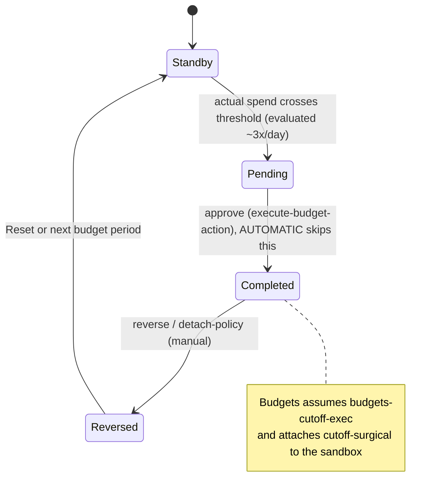
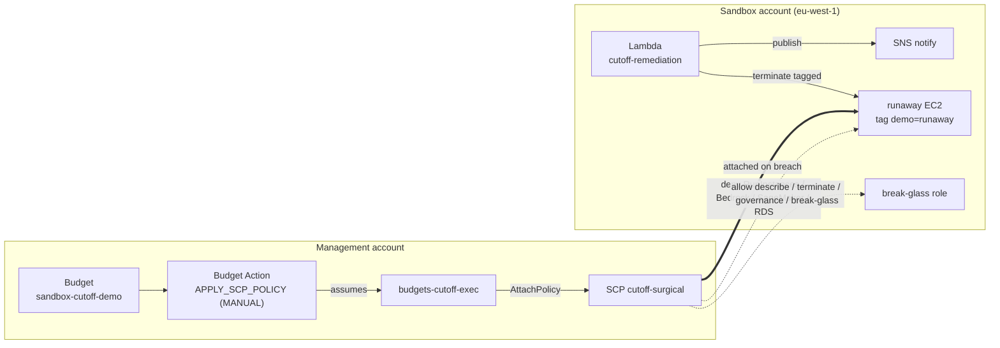

# aws-budget-cutoff

**Type:** `lab` — **Tags:** `aws` `finops` `budgets` `budget-actions` `scp` `organizations` `cost-control`

Cut an AWS bill that runs away **automatically**, before it becomes a five-figure Monday-morning
surprise. An [AWS Budget Action](https://docs.aws.amazon.com/cost-management/latest/userguide/budgets-controls.html)
of type `APPLY_SCP_POLICY` attaches a Service Control Policy to a sandbox account when a budget
threshold is crossed — no SNS, no Lambda, no EventBridge in the critical path. Two API calls, one
IAM role, one prepared SCP.

The twist this lab is built around is the **hybrid blast**: a surgical SCP that freezes the spend
*drivers* (launch EC2, invoke Bedrock, create SageMaker/RDS) while keeping the control room lit —
`describe`/`list`, org governance, a break-glass role, and `terminate`/`delete` for cleanup all stay
allowed. You stop the bleeding without blinding or handcuffing yourself.

## What it deploys

Two accounts, two providers (`aws` = management, `aws.sandbox` = the target member account).

| Where | Resource | Role |
|---|---|---|
| management | `aws_organizations_policy.cutoff_surgical` | hybrid cut-off SCP (created **unattached**) |
| management | `aws_organizations_policy.cutoff_hard` | `deny-all-but-break-glass`, contrast only |
| management | `aws_iam_role.budgets_exec` | role AWS Budgets assumes to attach the SCP |
| management | `aws_budgets_budget.cutoff` + `aws_budgets_budget_action.cutoff` | tiny budget + the `APPLY_SCP_POLICY` action (`MANUAL` approval) |
| sandbox | `aws_instance.runaway` | the resource that "burns money" (tagged `demo=runaway`) |
| sandbox | `aws_iam_role.break_glass` | admin role spared by every cut-off SCP |
| sandbox | SNS + Lambda `cutoff-remediation` | optional full-auto cleanup + notify (off critical path) |

## How it works

The Budget Action moves through a small state machine. Approving it (or `AUTOMATIC` approval) is
what makes the exec role attach the SCP; there is **no automatic reversal** when spend drops back
under the threshold, only a manual reverse (or a natural reset at the next budget period).



At runtime, each action maps to a specific resource across the two accounts. The critical path
(budget -> action -> role -> SCP attach) is entirely in the management account; the SCP then
constrains the sandbox, and the remediation layer (Lambda + SNS) sits off to the side.



## Why `MANUAL` approval

AWS Budgets evaluates roughly three times a day (every 8–12 h) on top of the usual billing-data
lag, so you cannot wait for a real threshold breach to fire on demand. With `MANUAL` approval the
action moves to `PENDING` once the (tiny) budget is exceeded; you then **approve it on demand** with
`execute-budget-action APPROVE_BUDGET_ACTION`. Apply the stack the evening before so the action is
`PENDING` when you need it. If it is not, the fallback is `aws organizations attach-policy` — the
exact payload the action would run. Both one-liners are in the outputs.

## Run it

Prerequisite: **management/org-admin access** (Budget Actions of type `APPLY_SCP_POLICY` are created
from the org management or a delegated-admin account) and a **sandbox member account**.

```bash
mise install
cp env/example.tfvars terraform.tfvars   # fill profiles, account ids, notify email
mise run init
mise run validate
mise run test-validate                    # creds-free variable validations
mise run apply                            # run the EVENING BEFORE (lets the action reach PENDING)
```

Then walk the demo (approve → freeze → hybrid → remediate → rollback):

```bash
MGMT_PROFILE=<mgmt> SANDBOX_PROFILE=<sandbox> ./scripts/steps.sh
```

Tear down with `mise run destroy`.

## Demo screen-share safety

Two **local-only** guards keep account IDs, ARNs, and credentials off screen during a live share.
Nothing here is committed, and a file hidden by these guards is **intentional, not a display bug**:

- **`scripts/steps.sh`** silences every AWS CLI call and prints a hand-written status line instead
  of raw JSON, so no account ID / ARN / credential ever reaches the terminal (a browser account-id
  blur extension does not cover the terminal).
- **`.vscode/settings.json`** (gitignored) hides `terraform.tfvars` and `*.tfstate*` from the
  Explorer, Go-to-File, and search so they cannot be opened by accident. `env/example.tfvars`
  (placeholders only) stays visible. Delete the file to restore normal visibility. Scoped to this
  example on purpose - open this folder as the VS Code workspace root for it to apply.

## Full-auto wiring (documented, not built)

The remediation Lambda is triggered here by a direct `aws lambda invoke`. In production you close
the loop with an EventBridge rule on the Organizations `AttachPolicy` CloudTrail event (management
account, `us-east-1`) invoking this Lambda cross-account. It is left out on purpose so the lab stays
account-local and readable — the critical path (the SCP attach) needs none of it.

## Guardrails

- The break-glass role is exempt from every SCP (`aws:PrincipalArn` `ArnNotLike`). Without it you
  can lock yourself out.
- SCPs are created **unattached**; only the action (or your explicit `attach-policy`) attaches one.
- A cut-off is a **last-resort net**, not a hard billing cap — pair it with Identity Center, short
  credentials, MFA on root, and team guidance upstream.
- Test on a non-prod OU first. An SCP's blast radius is proportional to its scope.
