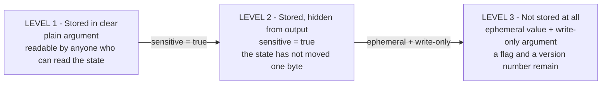
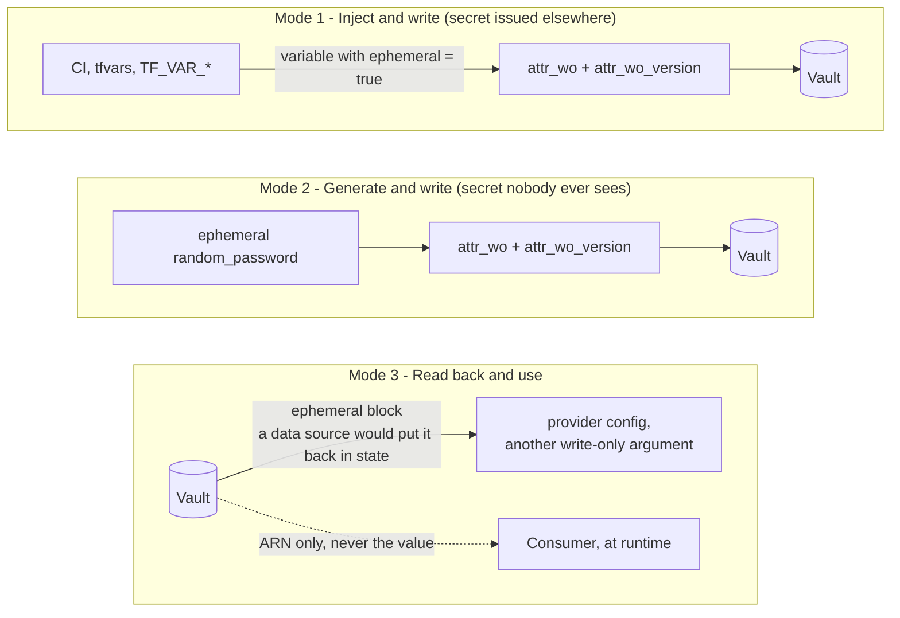

# terraform-secrets-out-of-state

> **Type**: `lab`
> **Tags**: `aws` `secrets` `ephemeral` `write-only` `rotation` `v1.11`

Backend remote, encrypted at rest, versioned, locked down, audited. Every box ticked, and the
token is still sitting in the state file in clear text. This lab walks the four native mechanisms
that fix that, **one at a time**, and each step ends on the defect the next one removes.

## In a hurry? Take [`final/`](final/)

The answer without the walkthrough, as a standalone root module:

```hcl
ephemeral "random_password" "app" {
  length = 32
}

resource "aws_secretsmanager_secret_version" "app" {
  secret_id                = aws_secretsmanager_secret.app.id
  secret_string_wo         = ephemeral.random_password.app.result # sent, never stored
  secret_string_wo_version = 1                                    # bump this to rotate
}
```

Terraform `>= 1.11`, and a provider that implements the write-only argument you need. Consumers get
the ARN and read the value at runtime.

Everything below is *why* each piece is there, and what breaks when one is missing.

## Two questions, two maps

Almost every argument about Terraform and secrets comes from mixing up two separate questions:
**how exposed is the secret**, and **which flow am I actually building**. One map each.

### How exposed is the secret?

Three levels, and they are about **storage**, not about what your terminal shows you.



The distinction matters because **level 1 already looks safe on screen**. The AWS provider marks
`secret_string` as `Sensitive` in its own schema, so a plan prints `(sensitive value)` before you
have configured anything. Nothing is hidden from the state, and everything is hidden from you.
That is why `sensitive` feels sufficient and is not.

### Which flow am I building?

Three ways a secret moves through Terraform. They are not variants of one another, and the third
is the one people forget.



Modes 1 and 2 differ only in **where the value comes from**; they share the same exit. Mode 3 is
the read path, and it carries its own trap: a plain `data` source puts the value back into the
state on what looks like a harmless read.

The rule that ties all three together: **neither an ephemeral block nor an ephemeral variable can
write anything.** They only bring a value in. Write-only arguments are the single exit toward a
managed resource, which is why the two are always used as a pair.

## What gets deployed

- One Secrets Manager secret, behind a customer-managed KMS key, holding a throwaway credential set
  (JSON, shaped like a chat-bot token).
- One Lambda **consumer that never changes across the six steps**: it receives the secret **ARN** in
  its environment, reads the value at runtime, and returns a SHA-256 fingerprint - never the value.
- A scoped IAM policy: `secretsmanager:GetSecretValue` on that one ARN, plus `kms:Decrypt` on that
  one key.

The consumer has two sinks, set with `-var sink=...`. `stdout` (default) returns the fingerprint in
the invoke response and needs nothing else. `twitch` also posts it to a chat, which exercises the
realistic shape: what rests in the vault is the durable **refresh token**, and a short-lived access
token is derived at each call and kept nowhere.

`app.tf` is the invariant half and is shown once. `secret.tf` is the only file that moves.

## The six steps

Uncomment the next step in `secret.tf`, comment the previous one, run the proof. Steps 3 and 4
fail on purpose.

| # | Mechanism | Proof | What you see |
|---|---|---|---|
| 1 | plain variable | `terraform state pull` | the token, in clear |
| 2 | `sensitive = true` | same command | **unchanged state**; a derived output now breaks the plan |
| 3 | `ephemeral = true` on the variable | `terraform plan` | `Invalid use of ephemeral value` |
| 4 | `ephemeral` block | `terraform plan` | `Ephemeral value not allowed` when referenced from an output |
| 5 | `secret_string_wo` + version | `terraform state pull` | `has_secret_string_wo: true`, no value |
| 6 | `ephemeral "random_password"` | bump the version | `1 -> 2 # forces replacement`, value never appears |

Proof commands are emitted as outputs (`state_proof_command`, `fingerprint_command`) so they can be
pasted rather than typed.

### Step 1 hides a trap worth pausing on

The plan already prints `secret_string = (sensitive value)` before anything is configured, because
the AWS provider marks that attribute `Sensitive` in its own schema. The plan looks safe. The state
is not. This is precisely why `sensitive` feels sufficient and is not.

### Steps 3 and 4, verbatim

```
Error: Invalid use of ephemeral value

Ephemeral values are not valid for "secret_string", because it is not a
write-only attribute and must be persisted to state.
```

```
Error: Ephemeral value not allowed

This output value is not declared as returning an ephemeral value, so it
cannot be set to a result derived from an ephemeral value.
```

The first message is the whole lesson, printed by the tool: the discipline is enforced by the
language, not by the author's vigilance.

## Rotation

`secret_string_wo_version` is stored in state; the value is not. Terraform cannot diff a value it
never kept, so the version is what carries **intent**.

- Bumping the version **replaces** the resource. That is correct: a secret version is immutable, so
  rotating creates a new one. `AWSCURRENT` moves to it, the previous one becomes `AWSPREVIOUS`.
- Changing the value **without** bumping sends nothing, silently. There is no warning, because there
  is nothing to compare against.
- Never derive the version from `timestamp()` or a uuid: perpetual diff, and a replacement on every
  plan. The version is persisted, so it cannot come from an ephemeral value either.
- Keeping it in configuration makes each rotation a reviewed, attributable change in `git blame`.

Scheduled rotation is the vault's job (`aws_secretsmanager_secret_rotation`), not Terraform's. The
useful consequence of write-only: with no value in state there is no drift on the value, so native
rotation and Terraform stop fighting over it.

## Migrating an existing secret

There is no migration section in the HashiCorp documentation. Here is what this lab measured on
`aws_secretsmanager_secret_version` (Terraform 1.11.0, AWS provider 6.x):

- Removing `secret_string` and adding `secret_string_wo` + `secret_string_wo_version` is an
  **in-place update**, not a replacement.
- The plan shows `secret_string -> null` and the new version argument. **`secret_string_wo` never
  appears in the plan** - write-only values are absent from plans by design.
- The value **is** transmitted: the vault ends up holding the new value. Verified end to end.
- The migrated state holds `has_secret_string_wo = true` and an **empty** `secret_string`.

One caveat before generalising: [hashicorp/terraform-provider-aws#42582](https://github.com/hashicorp/terraform-provider-aws/issues/42582)
reports this same migration silently clearing the password on `aws_db_instance`, and the fix is
still open. Behaviour is per-resource - measure it on yours before trusting it.

And the part no provider fix addresses: **earlier versions of your state still hold the old value.**
Migrating cleans the present, not the history. Rotate the secret, then migrate.

## Prerequisites

- **Terraform `>= 1.11.0`** (pinned via `mise.toml`): the floor for write-only arguments.
  `ephemeral` blocks land earlier, in 1.10.
- AWS provider `~> 6.0`, `random ~> 3.7`, `archive ~> 2.0`.
- AWS credentials for `apply` (`validate` needs none). Default region: `eu-west-1`.

## Run

```bash
terraform init
terraform apply                                  # step 1, the anti-pattern
eval "$(terraform output -raw state_proof_command)"   # the token, in clear
eval "$(terraform output -raw fingerprint_command)"   # what the consumer reads

# walk the steps in secret.tf, re-running the proof after each one

terraform destroy
```

Two things about the loop:

- The secret uses `recovery_window_in_days = 0`, so `destroy` frees the name immediately and the
  walkthrough can be replayed. Production secrets should keep the default 7-day window.
- The KMS key cannot be deleted immediately (7 days is the AWS minimum), so each `destroy` leaves
  one key pending deletion. The alias is freed straight away, so re-applying works.

**Right after the first apply, the consumer can fail with `AccessDeniedException` for a few
seconds.** The role and its policy have just been created and IAM is eventually consistent - wait
about ten seconds and invoke again. Nothing is wrong with the configuration.

## References

- [Manage sensitive data](https://developer.hashicorp.com/terraform/language/state/sensitive-data) -
  why state *and plan* files are both sensitive artifacts, and the four controls to put around them.
- [`terraform_remote_state`](https://developer.hashicorp.com/terraform/language/state/remote-state-data) -
  why exposing only root outputs is not an access boundary: reading them requires reading the whole snapshot.
- [Write-only arguments](https://developer.hashicorp.com/terraform/language/manage-sensitive-data/write-only) -
  the `_wo` / `_wo_version` pair, why drift detection is impossible, and how rotation is triggered.
- [Ephemeral resources reference](https://developer.hashicorp.com/terraform/language/resources/ephemeral/reference) -
  the closed list of contexts where an ephemeral value may be referenced.
- [Input variables](https://developer.hashicorp.com/terraform/language/values/variables) and
  [output values](https://developer.hashicorp.com/terraform/language/values/outputs) - what
  `sensitive` and `ephemeral` do on each, and what `sensitive` explicitly does not do.
- [`aws_secretsmanager_secret_version`](https://registry.terraform.io/providers/hashicorp/aws/latest/docs/resources/secretsmanager_secret_version) -
  `secret_string_wo`, its version argument, and the `has_secret_string_wo` flag.
- [Ephemeral `aws_secretsmanager_secret_version`](https://registry.terraform.io/providers/hashicorp/aws/latest/docs/ephemeral-resources/secretsmanager_secret_version) -
  reading a secret without landing it in state.
- [Ephemeral `random_password`](https://registry.terraform.io/providers/hashicorp/random/latest/docs/ephemeral-resources/password) -
  generating a secret for a write-only argument, and what to fall back on when none exists.
- [`aws_secretsmanager_secret_rotation`](https://registry.terraform.io/providers/hashicorp/aws/latest/docs/resources/secretsmanager_secret_rotation) -
  scheduled rotation owned by the vault, including the immediate first rotation on enablement.
- [Rotate secrets (AWS)](https://docs.aws.amazon.com/secretsmanager/latest/userguide/rotating-secrets.html) -
  the staging labels (`AWSCURRENT`, `AWSPREVIOUS`, `AWSPENDING`) a replacement moves around.

## Going further

- [`terraform-check-health`](../terraform-check-health/) - asserting on deployed infrastructure once
  the secret is in place.
- [`terraform-actions-lambda`](../terraform-actions-lambda/) - invoking a Lambda from a resource
  lifecycle, the shape a Terraform-driven rotation trigger would take.
